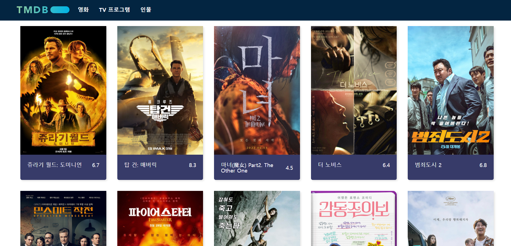

# 영화 사이트 구현 (학습 프로젝트)

- 더미데이터를 활용하여 영화 데이터를 화면에 나타냄
- 라우트를 활용하여 웹 경로 별로 다른 페이지가 나타나게 하는 사이트를 구축해보았다.
  -> 라우트를 구축하는 방법을 학습할 수 있었으며, 이미지를 보다 사용자에게 빠르게 제공하면서, 로딩을 최소화시키는 법에 의문을 갖게 되어 방안을 탐색하게 되었다 -> 해결방안으로 데이터를 가져와 이미지를 최적화시켜 렌더링시키거나 지연로딩을 시켰다면 사용자 경험이 향상될 수 있었을거라 생각된다.

;